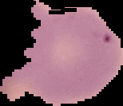
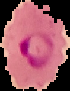

# Malaria-Disease-Detection
Malaria detection on histopathological images using Convolutional Neural Networks

Script written in Python 3.6, creating classifier to detect if histopathological image of blood cell is parasitized by malaria parasite.

Images are taken from Kaggle dataset: https://www.kaggle.com/iarunava/cell-images-for-detecting-malaria

Input data is images of cells, divided into two subsets - healthy and parasitized.

Healthy cell example from the dataset:

Parasitized cell example from the dataset:

Simple convolutional neural network with two convolutional layers is able to detect parasitized cells with validated accuracy around 95%.
It was trained using image data generator to prevent overfitting on existing dataset.
